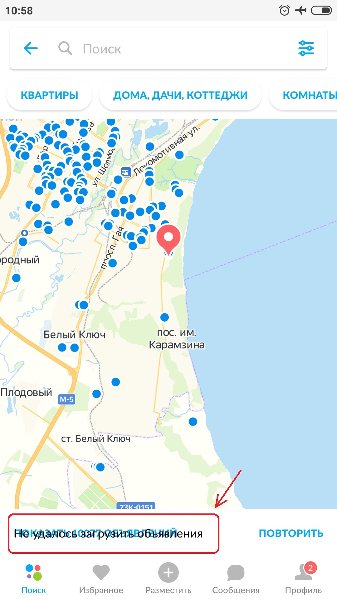

## Решение задания №1

**Условие:** Найти на Авито (сайт/мобильные приложения) один любой баг и описать на него баг-репорт.
Дополнительно: сделать это внутри категории коммерческая недвижимость.

### Баг-репорт "Наложение текста на карте в категории Недвижимость при отсутствии интернета"
| Attribute | Description |
| ------------- | ------------- |
| **Summary** | При создании условия сбоя интернет-соединения у юзера, возникает ошибка верстки, а именно наложение сообщения об ошибке на поле выбора объявления  |
| **Component** | Мобильное приложение "Авито"  Раздел "Недвижемость" |
| **Environment** | Mi Note 2, Android 8.0.0 |
| **Severity** | S4 (Minor) |
| **Priority** | P2 (Medium) |
| **Reproducibility** | Always |
| **STR** |    1. Открыть мобильное приложение Авито;   2. Открыть параметры (справа от поля Поиск);   3. Выбрать категорию - Недвижемость,   Город или регион - любой;   4. Нажать на кнопку «Показать N объявлений»;   5. Нажать на поле карты;   6. Перевести телефон в авиарежим;   7. Нажать на любое объявление на карте  |
| **Expected result** | Сообщение об ошибке "Не удалось загрузить объявления" перекрывает текст "Показать N объявлений" |
| **Actual result** | Сообщение об ошибке не перекрывает текст. Сообщение об ошибке всплывает внизу карты, но над полем "Показать N объявлений" |
| **Attachments** | |
